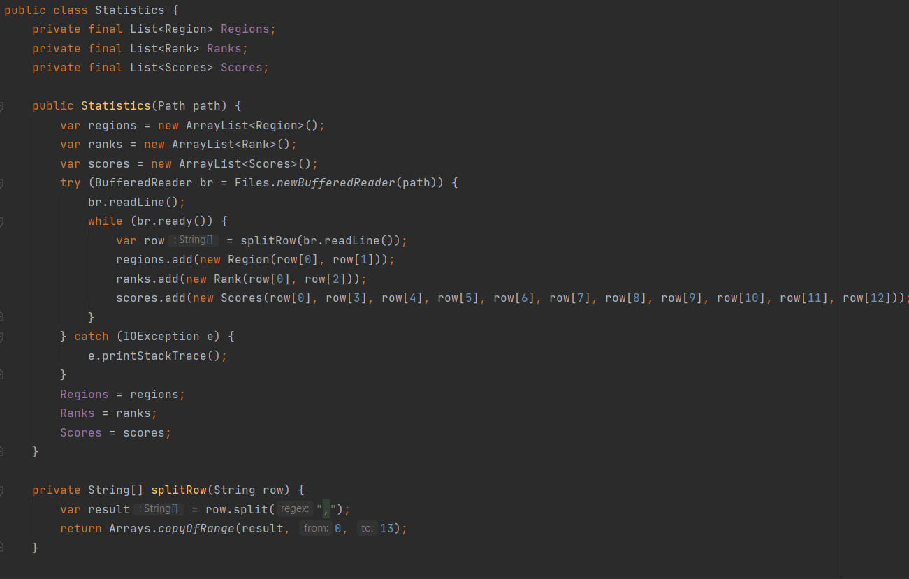
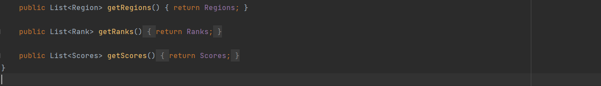
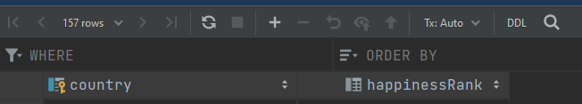
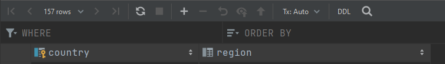
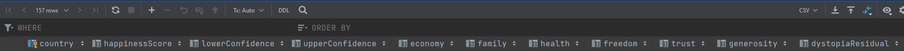
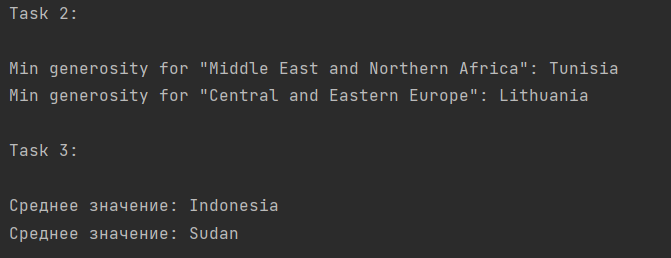
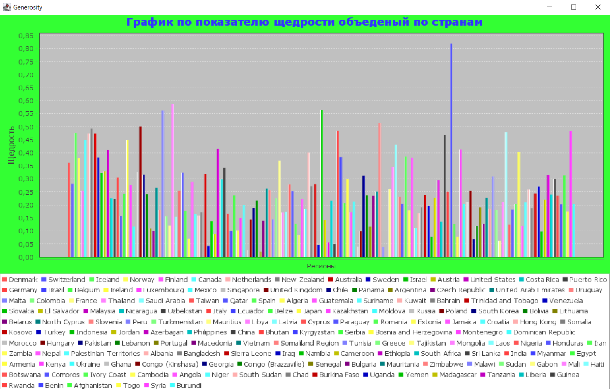

Соколов Михаил Иванович

1) Выбрал свой вариант под номером "10".
2) Создал сущности: 

    Main - основной класс с задачами.

    Rank - элемент таблицы rank.

    Region - элемент таблицы region.

    Scores - элемент таблицы scores.

    Statistic - хранение распаршеного CSV файла.

3) Распарсил CSV фаил и сохранил все данные:

4) Создал файл БД SQL Lite и подключить ее к проекту
5) В БД создал набор таблиц:

6) Все данные из набора объектов сохранил в БД.
7) Сделал набор SQL-запросов к БД.
8) Полученные данные вывел в текстовом виде в консоль:

9) Числовые данные по заданию визуализировал в виде гистограммы:

10) Для проекта создать открытый репозиторий на github и закоммитил туда всю работу по проекту.

11) В файле README описал последовательность работы по своему проекту.